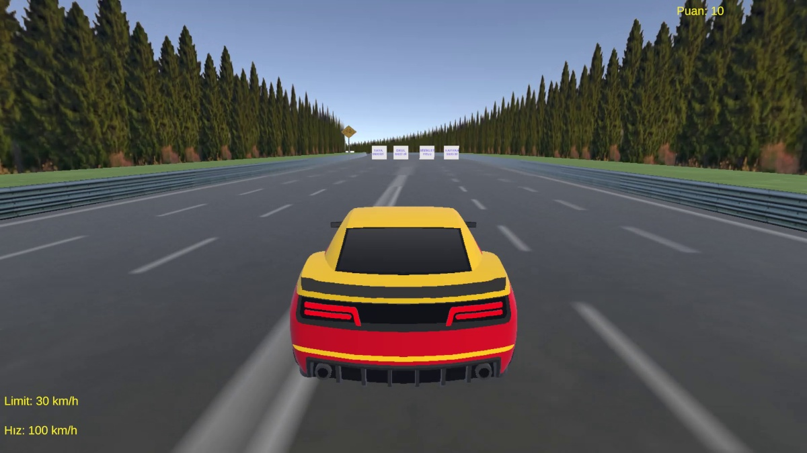
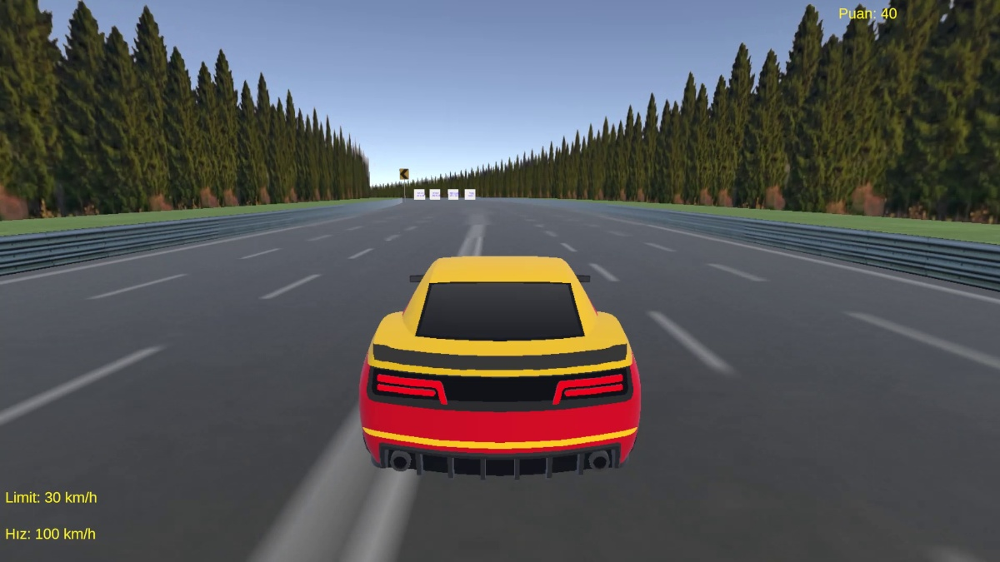
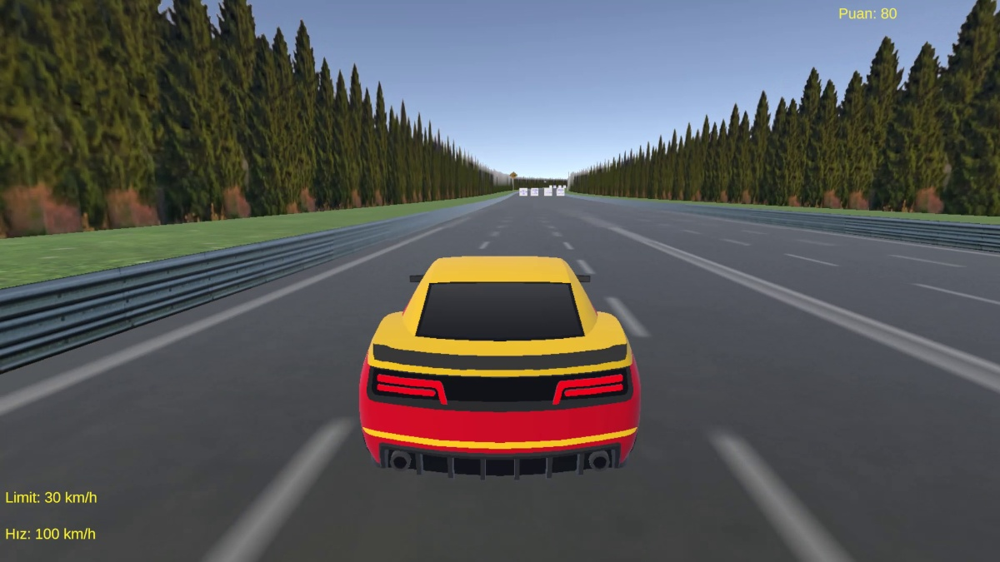

# Trafik Ustası — Unity Trafik ve Tabela Oyunu

Unity ve C# ile geliştirdiğim oyun programlama projesi. Oyuncu aracı parkurda sürerken trafik tabelalarına ilişkin soruları, doğru seçenek alanına girerek yanıtlar. Hız ve trafik ışığı ihlalleri puanı etkiler.

## Kendi katkım

Bu depodaki oyun kodlarını ben yazdım. Görsel ve ses varlıklarını Unity Asset Store'dan temin ettim. Tabela ve direk parçalarını birleştirerek işaretleri oluşturdum; tabelaları tek tek yerleştirdim ve parkurun sahne düzenini hazırladım.

## Oyun sistemleri

- Araç hızlanma, geri gitme ve dönüş kontrolü; hıza bağlı motor sesi.
- Dokuz soruluk tabela soru havuzu; araçla seçenek tetikleyicilerine girerek yanıt verme.
- Doğru yanıtta +10, yanlış yanıtta -10 puan; kodda başlangıç puanı 40.
- Trafik ışığı ve hız sınırı tetikleyicileri; DUR işareti kontrolü.
- Hız, limit, puan ve uyarı arayüzleri; oyun sonu ve yeniden başlatma.
- Müzik ve efekt ses düzeyi ayarları.

Depoda ayrıca aynı proje klasöründeki karakter hareketi, raycast etkileşimi, havai fişek, top zıplatma ve WheelCollider araç kontrolü çalışmaları bulunur.

## Kod rehberi

| Dosya | Görevi |
|---|---|
| `CarController.cs` | Araç hareketi, skor, trafik ihlalleri ve ses |
| `QuestionZone.cs` / `OptionTrigger.cs` | Soru içeriği ve cevap tetikleyicileri |
| `TrafficLight.cs` / `SpeedSign.cs` | Trafik ışığı döngüsü ve limit verisi |
| `TrafficUIManager.cs` | HUD, uyarı ve oyun sonu |
| `MainMenu.cs` / `SettingsManager.cs` | Menü ve ses ayarları |
| `araba.cs` | WheelCollider ve dokunmatik düğme girişleri olan alternatif araç kontrolü |
| Diğer `Scripts/` dosyaları | Karakter, nesne etkileşimi ve efekt çalışmaları |

## Proje yapısı

Kullandığım Unity sürümü **Unity 6000.3.9f1**, ana sahnesi `Assets/Scenes/Oyun.unity`. Paket manifestinde URP 17.3.0, Input System 1.18.0 ve Cinemachine 3.1.6 bulunuyor. Gösterilen kodlar eski `UnityEngine.Input` girişlerini de kullanıyor.

**Bu depo kaynak kodu ve görsel tanıtım paketidir; tek başına açılıp oynanabilen tam Unity projesi değildir.** Asset Store paketlerinin ham dosyaları, sahneler, Inspector bağlantıları, `Library`, APK ve derleme yedekleri dahil değildir. Hazır varlıkların paylaşım koşullarını netleştirmeden ham dosyalarını repoya eklemiyorum. [Varlık notları](docs/ASSETS.md).

Kodları denemek için uygun bir Unity projesinde `Scripts/` içeriğini içe aktarın; TextMesh Pro/UGUI bağımlılıklarını ve eski Input desteğini yapılandırın. Rigidbody, collider, etiket, seçenek kutuları ve UI/ses alanlarını Inspector'da bağlamak gerekir. Bu işlem özgün sahneyi otomatik oluşturmaz.

## Görseller

Oyundan aldığım ekran kaydından görüntüler:

## Geliştirmeye devam edeceğim noktalar

- Sarı ışık şu an kırmızı ışık etiketiyle aynı cezayı tetikliyor.
- Son soruya yanlış cevap verilirse başarılı bitiş akışı tetiklenmiyor.
- Cevap sesi çağrılarında AudioSource eksikliği için ek kontrol gerekiyor.
- Karakter zıplama kodunda grounded kontrolü yok.
- Menü açıkken araç kontrolünü durdurma ve puanlama davranışları Play Mode'da test edilmeli.
